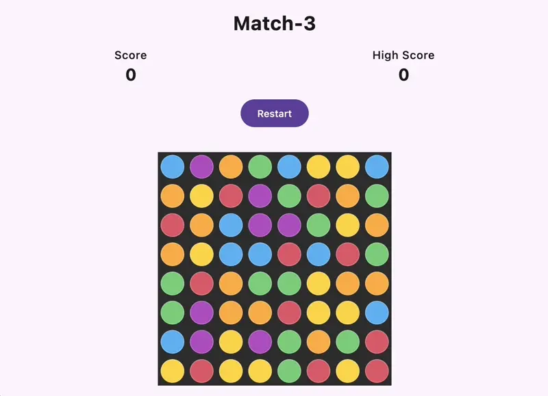
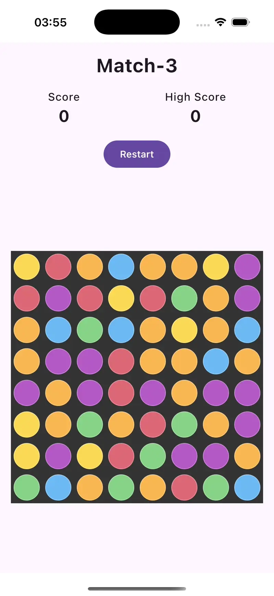

# Match3 Game – Kotlin Multiplatform with Compose

A simple Match 3 game developed as a Kotlin Multiplatform project using Compose Multiplatform.  
This project was ideated, documented, and implemented with AI tools including ChatGPT and Junie.

|Desktop| iOS |
|-|-|
|||

## 🎮 Game Overview

This is a basic Match 3 puzzle game designed for cross-platform deployment using Kotlin Multiplatform and Compose Multiplatform.  
Players swap adjacent tiles to match three or more of the same type, which are then cleared from the board and replaced with new tiles.

## 🧠 AI-Assisted Development

The development process was only using AI tools to streamline design, architecture planning, and coding:

### 📄 Documentation Generation with ChatGPT

Initial documentation was created using the following prompts:

**Prompt 1:**

> I want to develop a simple Match3 game in Kotlin Multiplatform. Please create the following documents:
> 
> - A game design document which describes a simple version of the game
> - A guideline document which sets technical boundaries regarding architecture
> - A code style guide

**Prompt 2:**

> Update the documentation so that Compose Multiplatform is used instead of SwiftUI or native code

The output from these prompts is available in the repository:
- 📘 [`match3_documentation.md`](match3_documentation.md)

### 🧑‍💻 Implementation with Junie AI

Code was written and iteratively improved with Junie using prompts such as:

- `Implement the game according to this documentation. If you are unsure at certain topics you can ask me.`
- `If I launch the app, all tiles are displayed in the top left corner of the game board.`  
  (Troubleshooting layout issues.)
- `Add tests for the Board` (with `Board.kt` as context)

Animation support was also attempted via several prompts, but no satisfying results were achieved — possibly due to late-night coding fatigue. 😄

---

Created with AI collaboration and Kotlin ❤️
